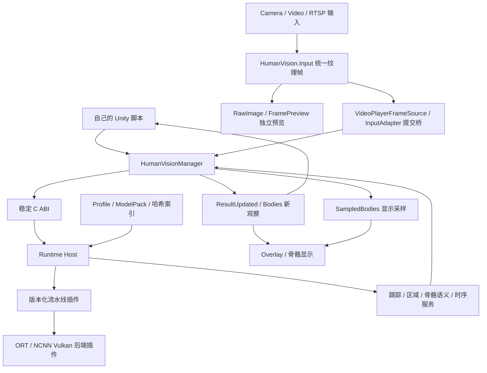

# 技术栈文档

适用 SDK `0.4.0-preview.4` / Input `0.1.0-preview.2`，面向新Unity项目接入。[文档首页](README.md)

## 1. 整体分层

Input可以独立获取与显示图像。接上提交桥和Manager后，SDK异步产生身体结果，应用通过公共语义关节读取数值。应用无需依赖具体模型的输出张量或原生后端类型。

## 2. 技术与职责

| 层 | 技术/模块 | 负责什么 | 源码/文档入口 |
| --- | --- | --- | --- |
| Unity宿主 | Unity2021.3+、C#、MonoBehaviour、协程 | 场景生命周期、主线程组件与UI更新 | [初始化与调用代码](FIRST_INSTALL.md#3-void-start中写什么) |
| 图像输入 | `HumanVision.Input`；WebCamTexture、VideoPlayer、原生RTSP输入 | 权限、采集/解码、定向纹理、源身份、帧元数据 | [Input Runtime](../../upm/com.blazetc.humanvision.input/Runtime) |
| 图像展示 | UGUI Canvas、RawImage、AspectRatioFitter、FramePreview | 实际图像与宽高比；输入预览不需要模型 | [FramePreview](../../upm/com.blazetc.humanvision.input/Runtime/FramePreview.cs) |
| SDK Unity接口 | `HumanVision.Runtime` | 运行资源准备、配置、Manager、身体/关节、P/Invoke | [SDK Runtime](../../upm/com.blazetc.humanvision/Runtime) |
| 提交与示例层 | `HumanVision.Demo` | 输入适配、CPU读回/GPU提交、Overlay、统一示例设置 | [Demo Runtime](../../upm/com.blazetc.humanvision/Runtime/Demo) |
| 原生核心 | C++17、C ABI、Runtime Host | 有界异步任务、插件装配、公共服务与数据复制 | [Runtime](../../runtime)、[公开头文件](../../native/include/humanvision) |
| Windows执行 | ONNX Runtime CPU / DirectML | 当前PC模型执行与硬件后端 | `windows-pc-cpu` / `windows-pc-directml` |
| Android执行 | ncnn、Vulkan、AHardwareBuffer、GPU fence | ARM64纹理复制与GPU模型执行；能力/合同不符会报错 | `android-ncnn-vulkan`质量族 |
| 运行组合 | Profile、ModelPack、质量目录、SHA-256索引 | 选插件/模型/实际尺寸/能力，并校验完整性 | [ModelPack指南](../maintenance/MODEL_PACK_GUIDE.md) |
| 示例配置 | JsonUtility、JSON、临时文件及备份 | 共享识别参数和各模式独立输入参数 | [设置API](API_REFERENCE.md#8-sdk设置质量和实际合同api) |
| SDK验证 | Unity Test Framework/NUnit、CTest、Python架构/打包检查 | 托管接口、原生ABI、功能、合同、导入和资产闭包 | [平台与测试边界](PLATFORM_TEST_RESULTS.md) |

入门脚本只依赖Runtime、Demo、Input和UnityEngine.UI。SDK不要求安装UniTask、Cinemachine、Localization或其他业务框架。若自己的脚本放入asmdef，显式引用`HumanVision.Runtime`、`HumanVision.Demo`、`HumanVision.Input`、`UnityEngine.UI`；放在普通Assets/Scripts时使用默认程序集即可。

## 3. 包、版本与平台组合

| 项目 | 当前版本/作用 | 接入规则 |
| --- | --- | --- |
| Input包 | `com.blazetc.humanvision.input`，`0.1.0-preview.2` | 先安装；可独立预览 |
| SDK包 | `com.blazetc.humanvision`，`0.4.0-preview.4` | 后安装，依赖Input |
| Git标签 | `v0.4.0-preview.4` | 两包同一标签，固定源码提交 |
| Windows原生资产 | x64 DLL及依赖 | 构建x86_64，保留依赖 |
| Android原生资产 | ARM64 SO和桥 | API26+、IL2CPP、ARM64、所选Vulkan路线 |
| RuntimeData | profiles/modelpacks/models/quality catalog/index | 编辑器安装到StreamingAssets；运行Prepare后使用回调路径 |

当前发布闭包覆盖Windows CPU/DirectML和Android NCNN Vulkan。其他后端接口、其他平台源码存在，不等于相应安装组合或硬件已验收。具体依据见平台文档。

## 4. 采集尺寸、模型尺寸与骨骼语义

| 路线 | 实际身体模型输入 | Profile |
| --- | --- | --- |
| Windows CPU | 416×416 | `windows-pc-cpu` |
| Windows DirectML | 416×416 | `windows-pc-directml` |
| Android Low | 512×288 | `android-ncnn-vulkan-quality-low` |
| Android Medium | 640×384 | `android-ncnn-vulkan` |
| Android High | 960×576 | `android-ncnn-vulkan-quality-high` |

相机`RequestedWidth/Height/FPS`是设备采集请求，实际尺寸来自源纹理；模型尺寸来自已验证运行合同，不能用修改请求分辨率或任意JSON尺寸代替更换模型。

当前PC打包使用RTMO身体配置，Android质量族使用YOLO姿态路线。公共API返回身体和语义关節，隐藏模型输出布局。32语义槽位包含派生点，读取时检查Valid/Confidence/IsDerived和观察时间。当前随包配置关闭真实手任务；RGB图像坐标不提供米制3D深度。

当前Android NCNN GPU输入适配还要求定向后的源图像为横向16:9；这和模型内部的Low/Medium/High尺寸是不同合同。比例不符时预览可继续，识别提交会报错。

## 5. 新项目的调用顺序

| 步骤 | SDK调用 | 含义 |
| --- | --- | --- |
| 安装资源 | 编辑器Install Packaged Models | 把索引与完整运行数据带入项目 |
| 准备 | `yield return HumanVisionRuntimeData.Prepare(...)` | 校验/提取资源，成功返回RuntimeRoot |
| 初始化 | `manager.TryInitialize(config)` | 创建Runtime会话；失败看LastError |
| 关联显示 | `bridge.Configure(...)`、`overlay.Configure(...)` | 把识别器、预览、比例和骨骼层关联 |
| 打开输入 | `source.Open(settings)` | 异步开启相机/视频/RTSP |
| 绑定提交 | `bridge.BindUnifiedSource(source)` | 桥自动提交，Manager.Update自动轮询 |
| 读新观察 | `manager.ResultUpdated += handler` | 按BodyCount读取Bodies、检查有效点与身份 |
| 显示 | Overlay / SampledBodies | 骨骼绘制或显示平滑；不增加新观察数 |
| 停止 | Detach → 等退休 → Close → Shutdown | 防止复制未结束时释放源资源 |

初始化、模型加载、Shutdown和改变容量属于控制操作，可能耗时；CPU SubmitFrame或GPU提交是异步受理，不能据返回true断言完成推理。最新未处理帧可被覆盖，避免积累旧帧延迟。

## 6. 数据、线程与资源约定

- Unity组件/API在主线程使用，推理工作由原生Runtime调度；应用不用另开线程操作Bodies或UI。
- `StableTrackId`、`RegionIndex`、`Bodies[i]`分别代表身份、区域、快照数组位置。不要以数组下标固定绑定玩家。
- `Bodies`是原始观察；`SampledBodies`是显示采样。重复采样同一结果不增加识别FPS。
- 身体/关节对象反复复用；在回调中读取，历史记录复制值，避免保存引用后数据被下次轮询改变。
- 图像左上为原点、Y向下，镜像/旋转由Input定向处理；不要重复反转。把图像点映射到UI时处理宽高比与坐标原点。
- 输入单调时钟、Unity/原生时钟、媒体PTS用途不同；仅在同一或已经映射的时钟域内计算年龄。
- 区域用于当前推理后的结果分配；修改时递增revision，不把区域框当像素遮罩或已证明的性能优化。
- GPU复制完成的fence不表示推理完成。切源/卸载前等待退休，不能提前释放被复制使用的纹理。
- 消费层需处理结果超时、无身体、点无效、遮挡、ID改变和输入停止。SDK骨骼API不会自动替应用定义跑步/跳跃规则。

## 7. 扩展与维护入口

| 需要做什么 | 先看哪里 |
| --- | --- |
| 自己的UI或交互 | [入门示例](FIRST_INSTALL.md)、[API](API_REFERENCE.md) |
| 新输入源 | Input接口、帧身份/时钟、SourceCopyLease与生命周期 |
| 新ModelPack/Profile | [模型包指南](../maintenance/MODEL_PACK_GUIDE.md)，能力声明和哈希索引 |
| 新pipeline/backend | [维护入口](../maintenance/START_HERE.md)，版本化Plugin ABI和独立测试 |
| SDK源码构建/发布 | [发布指南](../maintenance/RELEASE_GUIDE.md) |

安装用户不需要改原生源码。开发时不要直接改Library/PackageCache；需要维护SDK时先按START_HERE中的架构和文档合同定位对应模块。
