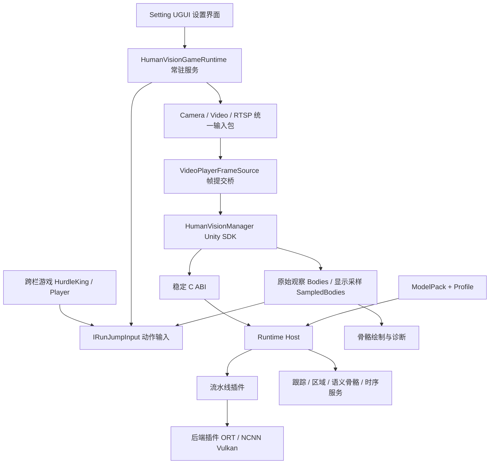

# 技术栈文档

适用 SDK `0.4.0-preview.4` 与正式项目 `Sensory-Game-2021.3.45`，核查日期 2026-10-07。[文档首页](README.md)

## 1. 整体分层

游戏通过区域和动作状态使用 SDK；模型、张量格式、推理后端留在 SDK 内。Settings UI 的生命期与识别服务分离，因此换场景不需要反复创建识别器。

## 2. 技术与实际职责

| 层 | 使用的技术 | 本项目职责 | 核查入口 |
| --- | --- | --- | --- |
| 游戏引擎 | Unity 2021.3.45f1、C# | 场景、游戏循环、对象更新 | 项目 `ProjectSettings/ProjectVersion.txt` |
| 设置 UI | UGUI：Canvas、RawImage、Dropdown、InputField、Scroll、Graphic | 设置草稿、真实画面、区域拖框、状态、动作阈值与日志 | 项目 `VisionSettingsView/ VisionSettingsLayout` |
| 游戏异步启动 | UniTask、Unity 协程、SceneManager | Init 等本地化、识别启动并切场景 | 项目 `GameLoading.cs` |
| 输入包 | `HumanVision.Input`，WebCamTexture、VideoPlayer、原生 RTSP 输入 | 相机/视频/网络解码与统一纹理帧 | [输入包 Runtime](../../upm/com.blazetc.humanvision.input/Runtime) |
| Unity SDK | `HumanVision.Runtime`、`HumanVision.Demo` | 运行数据准备、会话、P/Invoke、骨骼数据、提交/显示桥 | [SDK Runtime](../../upm/com.blazetc.humanvision/Runtime) |
| 原生核心 | C++17、C ABI | 异步提交、Runtime Host 与公共服务 | [Runtime](../../runtime)、[C 头文件](../../native/include/humanvision) |
| Windows 推理 | ONNX Runtime CPU/DirectML | 当前 PC 的模型执行 | `windows-pc-cpu` / `windows-pc-directml` Profile |
| Android 推理 | ncnn、Vulkan、AHardwareBuffer、GPU fence | 定向纹理拷贝、GPU 输入和姿态推理；不静默 CPU 回退 | `android-ncnn-vulkan` 与质量 Profile |
| 模型/组合 | ModelPack JSON、索引 SHA-256、Profile JSON | 选择模型族、实际尺寸、后端、能力、是否启用手部 | [ModelPack 指南](../maintenance/MODEL_PACK_GUIDE.md) |
| 配置 | JsonUtility、JSON 文件、临时文件/原子替换/备份 | 全项目共用一份保存配置 | 项目 `VisionSettingsStore` |
| 诊断 | CSV、JSONL、有限写队列、ZIP、Android 系统导出 | 运行状态、吞吐、关节点和故障记录 | 项目 `VisionDiagnostics/BufferedLogWriter/VisionLogAccess` |
| 自动测试 | Unity Test Framework / NUnit、CTest、Python 结构与打包检查 | API/布局/动作/ABI/架构/包闭包回归 | [平台测试文档](PLATFORM_TEST_RESULTS.md) |

项目同时使用 Localization、TextMeshPro、Cinemachine、Timeline 等依赖。它们是正式游戏的依赖，不意味着 SDK 骨骼识别需要依赖所有这些包。项目 SDK 适配程序集只显式引用 Runtime、Demo、Input 和 UnityEngine.UI。

## 3. 包与平台边界

| 包/资产 | 版本或作用 | 使用规则 |
| --- | --- | --- |
| `com.blazetc.humanvision.input` | `0.1.0-preview.2` | 可独立预览，不依赖骨骼模型 |
| `com.blazetc.humanvision` | `0.4.0-preview.4` | 骨骼识别及输入适配；需 Input |
| Git 标签 | `v0.4.0-preview.4` | 两包用同一标签；项目 lock 同一提交 |
| Windows 原生资产 | x64 DLL | 保留插件依赖，不单独搬走 humanvision.dll |
| Android 原生资产 | ARM64 SO | API26+、IL2CPP、所选路线的 Vulkan 能力/桥校验 |
| RuntimeData | profiles、modelpacks、quality catalog、index | 安装/构建按索引校验，运行提取后再次匹配 |

此版已发布包的合格使用路线是 Windows CPU/DirectML 与 Android NCNN Vulkan。代码中还有其他后端、模型和模式接口；存在接口不等于该组合已打包合格。iOS/macOS/Linux/RK3588 不在本套正式项目证据覆盖内。

## 4. 真实模型输入与采集分辨率

| 场景 | 当前实际输入合同 | 设置界面含义 |
| --- | --- | --- |
| Windows PC CPU/DirectML | 身体模型 `416×416` | Android 模型等级选择不会改变 PC 合同 |
| Android NCNN 低 | `512×288` | 对应 `android-ncnn-vulkan-quality-low` |
| Android NCNN 中 | `640×384` | 对应 `android-ncnn-vulkan` |
| Android NCNN 高 | `960×576` | 对应 `android-ncnn-vulkan-quality-high` |
| 相机采集 | 请求如 `1280×720 / 30FPS`；实际以源帧为准 | 影响采集，不直接定义模型尺寸 |

Android 当前质量族是 YOLO 姿态路线；PC 使用当前打包的 RTMO 身体配置。公共 Unity API 只返回语义身体与关节，不要求游戏知道模型下标。32 点规范含派生位置，随包 Profile 关闭真实手部推理。不能拿槽位数推断真实手指、深度或全部关节点有效。

## 5. 正式项目调用链

| 环节 | 项目代码 | 实际行为 |
| --- | --- | --- |
| 启动 | `GameLoading.Start` | 目标显示60FPS；EnsureInstance、读取已保存配置；等待启动，最后载入 HurdleKing |
| 服务 | `HumanVisionGameRuntime.Awake/Start` | DontDestroyOnLoad，唯一 Manager/Bridge，注册 ResultUpdated，启动诊断 |
| 配置预检 | `Apply/Preflight` | 验证草稿和源参数；Prepare RuntimeRoot；解析实际 Profile/质量合同 |
| 替换源 | `RetireSource/Initialize/OpenSource` | 换 Generation、清理动作，等 GPU 拷贝退休，再初始化及打开源 |
| 成功应用 | `ApplyRoutine` | 仅源 Streaming 才替换 Active/Contract；需要时保存；失败尝试恢复旧配置 |
| 新骨骼 | `OnResult` | 去掉重复序号；检查显示可用性、年龄和区域 revision；复制数值快照 |
| 动作 | `PoseMotionDetector.Observe/Read` | 每区域状态机：摆臂+新抬腿计步、髋上升+速度起跳；读取时衰减/失效 |
| 游戏消费 | `HurdleKingManager.ApplyKeyboardInput` | 按 players 下标取区域状态；强度控制跑速；每次新 JumpSequence 只跳一次 |
| 设置 | `SettingManager/VisionSettingsView` | UI 从 Saved 复制草稿；应用成功刷新显示；返回游戏保留服务 |
| 日志 | `VisionDiagnostics` | 事件、阶段统计、有限频率骨骼记录和导出 |

目前明确消费跑跳状态的游戏是 HurdleKing；常驻服务供其他场景使用，并不表示每个游戏都已接好动作控制。

## 6. 数据规则：接入时最容易误解的部分

- **身份**：`StableTrackId` 是跟踪身份，`RegionIndex` 是区域，`Bodies[i]` 是当前快照的数组位置。它们不能混用。
- **原始与显示**：`Bodies` 用于新观察/动作/计数；`SampledBodies` 用于平滑显示。重复显示同一结果不增加识别吞吐。
- **数组**：SDK 复用对象与数组。事件中读完即可；历史要复制数值。正式项目 `PoseObservationFactory` 就是这个边界。
- **坐标**：关节点为 RGB 图像平面，归一化 Y 向下。兼容 `GetJointPosition` 的 z 为0，不是米制3D。
- **时间**：源观察、Unity 发布、流 PTS 是不同含义；只有同一/已映射时钟可相减。结果年龄不自动等于传感器拍摄到显示延迟。
- **区域**：当前已发布路线按推理结果分配区域，不把区域拖框宣称为像素遮罩或推理加速。修改区域要检查 revision，避免用旧配置结果控制新角色。
- **并发**：Unity 对象和这些接入接口在主线程用；推理异步、最新待处理帧优先。Create/Shutdown/重新初始化属于控制操作，可能耗时。
- **资源**：GPU fence 证明源纹理快照拷贝完成，不等于模型推理完成。切源不能提前释放仍被拷贝使用的纹理。

## 7. 维护应改哪里

| 需求 | 优先改动位置 | 验证重点 |
| --- | --- | --- |
| 游戏跑跳规则/阈值 | 项目 `PoseMotionDetector`、`MotionSettings` | 新结果、失效、换人、单次跳跃消费 |
| 游戏角色接入 | `IRunJumpInput` 的消费者 | 区域下标、游戏人数、输入模式 |
| 设置布局 | 项目 `VisionSettingsLayout/View` 或已生成场景 | CanvasRenderer、引用、草稿与应用区分 |
| 相机/视频/RTSP 源 | Input 包对应组件 | 生命周期、实际尺寸、帧身份/时钟、重连 |
| 兼容权重/质量选择 | ModelPack + Profile + 哈希索引 | 合同、版本和包闭包 |
| 新算法/后端 | 对应 pipeline/backend 插件 | Plugin ABI、能力声明、独立黄金测试 |
| 跟踪/时序/骨骼语义 | Runtime 公共服务 | 稳定身份、有效点、时间戳和采样 |

维护先读 [START_HERE](../maintenance/START_HERE.md)，不要直接修改 Unity PackageCache 或让游戏依赖模型文件名。安装用户无需自己编译 C++；SDK 开发者的编译/发布流程见 [RELEASE_GUIDE](../maintenance/RELEASE_GUIDE.md)。

## 8. 本次核查发现的使用注意事项

1. 当前正式项目的接入边界清晰：常驻识别服务与游戏动作接口分开，设置变化有预检和资源退休流程。
2. 默认混合键盘输入只适合调试；骨骼验收应单独选择 Skeleton。
3. 日志 `fresh_result_fps` 统计的是被项目接受的新结果事件，尚不是每个参与者的完整有效骨骼 FPS；详细骨骼默认0.2秒节流。
4. 新会话容量/轮转参数由诊断器创建时取快照，应用参数不自动重建已有日志写入器；需要重新创建服务/重启生效。
5. 当前保存的 Profile/尺寸字段应以运行解析的 Contract 为准；直接修改 JSON 的模型尺寸不会改变真实模型。
6. 本次只读分析与补充文档，没有修改游戏功能，也没有将旧平台结果当作正式项目新验收。
